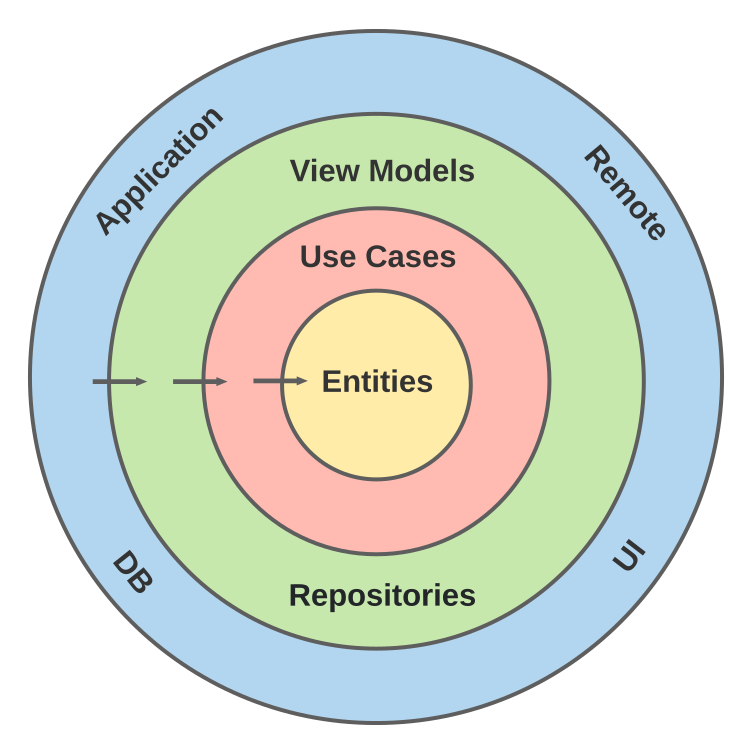
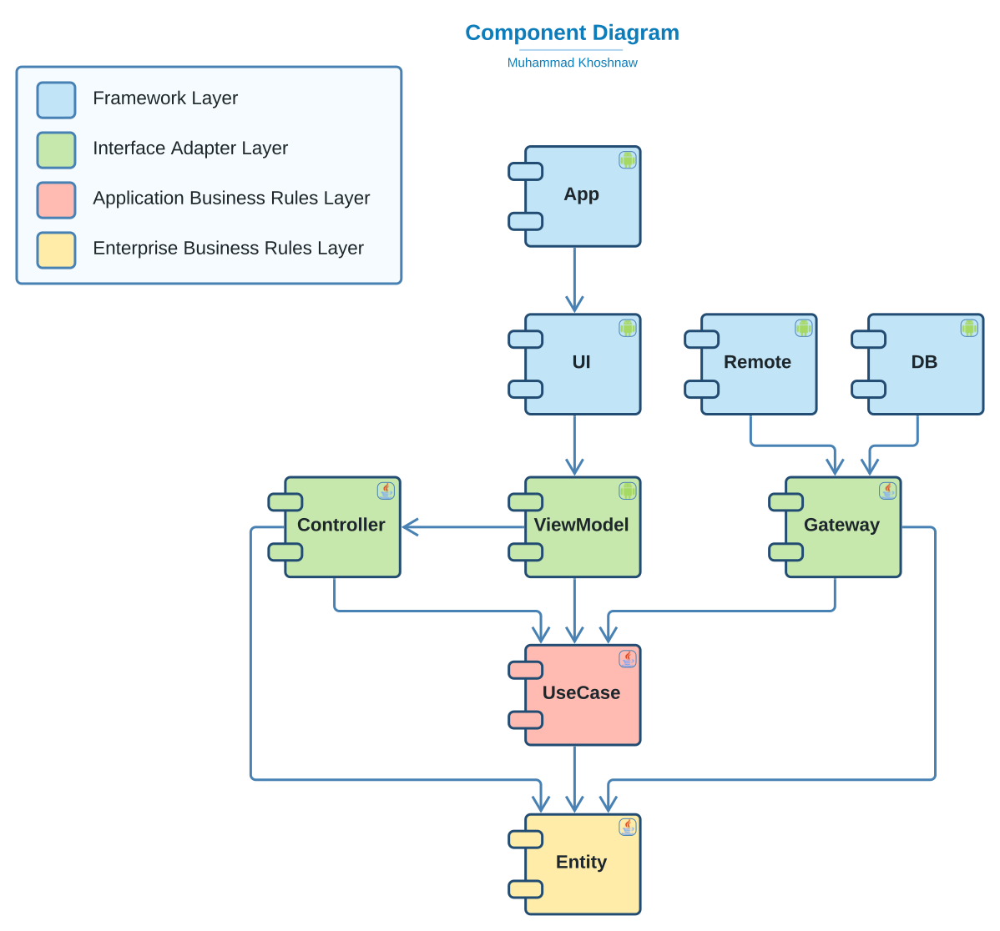
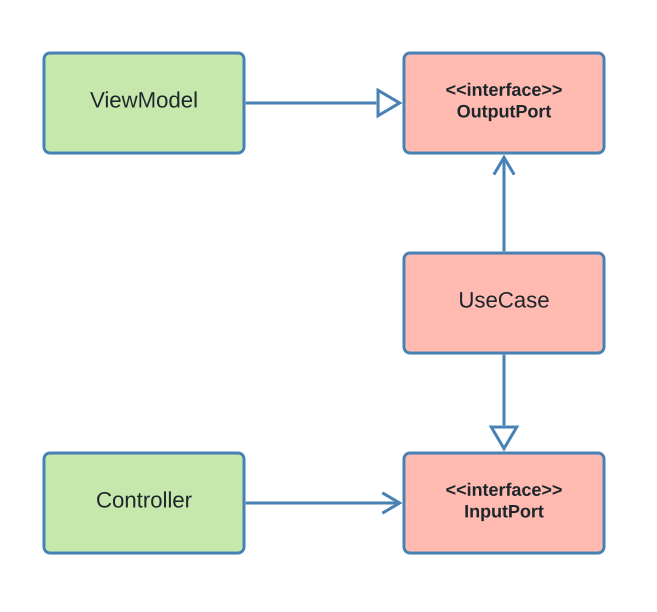
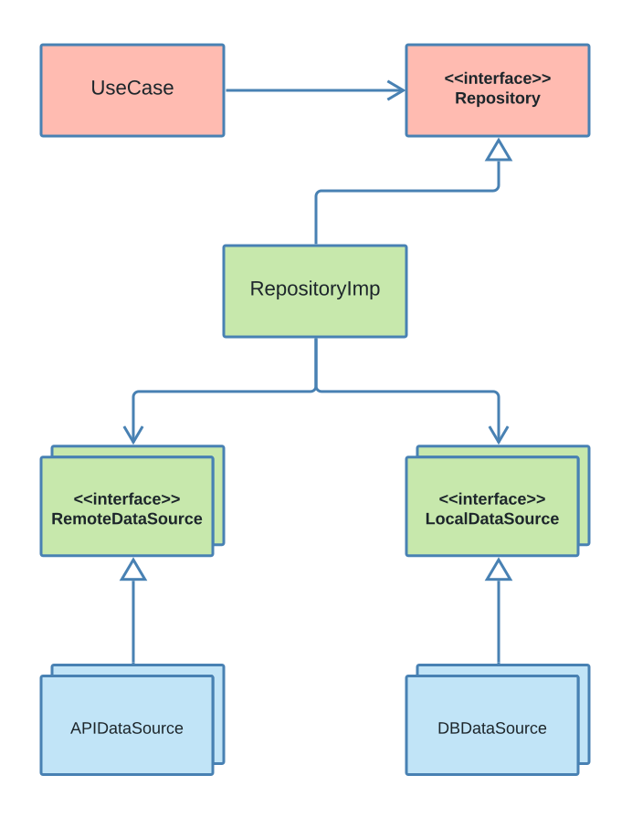

# BasicMVIApp

This application is a basic study application that implements clean architecture, with the MVI architecture pattern. In addition to the most commonly
used tools in the android development community.

# Motivation

When starting a new project it is always difficult to build the setup environment. Building the application architecture and choosing the desired
architecture pattern (MVI, MVVM or MVP) can be challenging. I always Liked to have a template that I can use whenever I need it. In addition, when
using this template in a large application you discover the pros and cons of your template structure. And you can always come back to the template and
improve it for the next project. This Repository Will be my first android application template. In this template clean architecture and MVI
architecture pattern is my weapon of choice.

# Application

For this template, we don't need to go crazy with features. We just need enough to understand the architecture and have some basic configurations that
we can reuse In future. The application is a basic movie app. That uses [TMDB API](https://www.themoviedb.org/documentation/api) to cash a list of
popular movies. And then show it to the user. With the ability to refresh the cache when the user needed it.

- Add the key `tmdb_api_key={API_KEY}` in your `local.properties` file to run the project
- ⚠️🚧 Don't check out API keys to version control ⚠️🚧

# Architecture

## Introduction

Starting the development of software without a clear architecture will cause a disaster. The same way that starting construction of a building without
a clear architecture will cause a disaster. It is true that without an architecture you can go really fast for the first few features in the app but
does that really matter!
If you are not able to do any major changes in the software after a year. Logging with google took one week to implement but after one year of
development logging in with Facebook took a month or two and even then it was really buggy. If you are too scared to do anything in the software after
a few years. Does building the first few features fast really matter?

> “The only way to go fast, is to go well.”
> ― Robert C. Martin, Clean Architecture

## Clean Architecture

There are multiple common architectures that you can use for your software. But I think clean architecture is the most commonly used architecture in
the android development community. So I choose to use clean architecture for this template. While studying Clean architecture I read multiple articles
about implementing clean architecture in android. I also checked a few GitHub repositories but most of them didn't have what I wanted. I believe most
of them are the wrong implementation of clean architecture and the implementation violated the architecture principles. So for this template, I will
depend on this article by [Robert C. Martin](https://blog.cleancoder.com/uncle-bob/2012/08/13/the-clean-architecture.html)



As shown in the above diagram the template consists of 4 architecture layers. Be careful that those layers are architecture layers AND YOU DON’T HAVE
TO CREATE A MODULE FOR EACH LAYER. Software components (modules) are different from architecture layers. You can have as many software components as
you need in each architecture layer. In android, we create software components by modules. So for example we can separate our entities into two
different modules or even more. The same thing applies to use cases and other layers.



For this template, eight different software components have been used as shown in the diagram.

1. In the innermost layer, we have an entity which is a java module.
2. Then In the second layer, we have useCase another java module.
3. For the third layer, we have two modules: repository and ViewModel both of them are android module with as minimum dependency as possible on the
   android platform.
4. And in the outermost layer, We have 4 heavily dependent on the android framework modules. The application is our actual application module. UI,
   Remote and DB are also android modules.

Of Course, you can have more layers but I don’t think having fewer layers will be a good idea. For this template, we are trying to have the most basic
implementation possible so we go with 4 layers.

# Enterprise Business Rules Layer

## Entity

Entities are business objects of the application. They encapsulate the most abstract information about our business rules that are less likely to
change when something external changes. It is preferred to make our entities a simple data class that just encapsulates data and not behaviours. I.e
it is preferred to not have functions in our entity class.

For example in our entity, we have our [Movie](entity/src/main/java/com/khoshnaw/entity/Movie.kt) Class which have some movie properties. Those
properties will not be changed if we change the navigation of our application. or added a filter for example.

```
data class Movie(
    val id: String,
    val posterPath: String,
    val title: String,
    val voteAverage: Double,
)
```

### TestFixtures

In this module, we also have some test fixtures. [MovieDummies](entity/src/testFixtures/java/com/khoshnaw/entity/MovieDummies.kt) has some dummy movie
objects that we will be needed in our tests.

```
@Suppress("unused", "MemberVisibilityCanBePrivate")
object MovieDummies {

    val dummyMovie = Movie(
        id = "0",
        posterPath = "/b6qUu00iIIkXX13szFy7d0CyNcg.jpg",
        title = "Eternals",
        voteAverage = 7.3
    )

    val dummyMovie1 = Movie(
        id = "1",
        posterPath = "/aWeKITRFbbwY8txG5uCj4rMCfSP.jpg",
        title = "Sing 2",
        voteAverage = 8.3
    )

    val dummyMovie2 = Movie(
        id = "2",
        posterPath = "/1g0dhYtq4irTY1GPXvft6k4YLjm.jpg",
        title = "Spider-Man: No Way Home",
        voteAverage = 8.4
    )

    val dummyMovie3 = Movie(
        id = "3",
        posterPath = "/sg4xJaufDiQl7caFEskBtQXfD4x.jpg",
        title = "Ghostbusters: Afterlife",
        voteAverage = 7.6
    )

    val dummyMovie4 = Movie(
        id = "4",
        posterPath = "/4j0PNHkMr5ax3IA8tjtxcmPU3QT.jpg",
        title = "Encanto",
        voteAverage = 7.8
    )

    val dummyMovie5 = Movie(
        id = "5",
        posterPath = "/7uRbWOXxpWDMtnsd2PF3clu65jc.jpg",
        title = "Resident Evil: Welcome to Raccoon City",
        voteAverage = 6.1
    )

    val dummyMovieList = listOf(
        dummyMovie,
        dummyMovie1,
        dummyMovie2,
        dummyMovie3,
        dummyMovie4,
        dummyMovie5,
    )
}
```

ExceptionDummies have a FakeException object that we will use in our tests.

```
object ExceptionDummies {
    val dummyException = FakeException()
}

```

```
class FakeException : Exception()
```

For more information about test fixtures check out [Using test fixtures
](https://docs.gradle.org/current/userguide/java_testing.html#sec:java_test_fixtures)

# Application Business Rules Layer

## UseCase

In most clean architecture implementations you see that use cases are just a class with a single method. I don’t know where that concept comes from.
But I don’t think that this concept is related to clean architecture. UseCase is much more than a class with a single method. It is your user story.
your business rules. You basically need to translate the user story that you have in your Jira ticket to a UseCase class in your Application Business
Rules layer.

### Base Implementation

Back to our template in the base package, you will see InputPort, OutputPort And UseCase, base classes.



As you can see the ViewModel has an object of the UseCase that has an InputPort type. And then the UseCase also has an Object of ViewModel with the
type OutputPort. This will reverse the dependency between UseCase and ViewModel. Let’s look at the actual code.

```
interface InputPort<in O : OutputPort> {
    suspend fun registerOutputPort(outputPort: O)
}
```

Our `InputPort` has a general type of `OutputPort`. We will be using this general type in the `registerOutputPort` function to register
the `ViewModel` in the `UseCase` as an `outputPort`. You might think that this is better to be done with dependency injection. Well, you are
absolutely right, But I faced some limitations with android ViewModels that made me not able to use dependency injection to bind the ViewModel to the
outPort. So I’m sticking to this function for now. Maybe in the future, I will find a better solution for this.

The `OutputPort` is a simple interface.

```
interface OutputPort
```

Now coming to the main course, UseCase has a general type of `OutputPort` that we use for the outputPort variable. The onReady function will be called
right after the `outputPort` is registered. So you can run your setup code. We also have the default implementation for `registerOutputPort`.

```
abstract class UseCase<O : OutputPort> : InputPort<O> {
    protected lateinit var outputPort: O

    protected open suspend fun onReady() = Unit

    override suspend fun registerOutputPort(outputPort: O) {
        this.outputPort = outputPort
        onReady()
    }
}
```

Then last but not least we have the base Repository interface. Which is an empty interface that might be useful in future for some polymorphism
implementation. We will discuss Repository in more detail later on. But for now, you just need to know that Usecases will use a Repository to access
data in our android framework. Like data in remote API or local DB.

```
interface Repository
```

### Repository interfaces

For this template, we only have one repository
called [MovieRepository](useCase/src/main/java/com/khoshnaw/usecase/movie/repository/MovieRepository.kt)

```
interface MovieRepository : Repository {
    suspend fun updateMovieList()
    suspend fun observeMovies(): Flow<List<Movie>>
    suspend fun loadMovieSize(): Int
}
```

### LoadMovieList

Let's look at [LoadMovieListInputPort](useCase/src/main/java/com/khoshnaw/usecase/movie/loadMovieList/LoadMovieListInputPort.kt). Our input port has
one command that starts updating a movie list in the system cash.

```
interface LoadMovieListInputPort : InputPort<LoadMovieListOutputPort> {
    suspend fun startUpdatingMovieList()
}
```

Then we have [LoadMovieListOutputPort](useCase/src/main/java/com/khoshnaw/usecase/movie/loadMovieList/LoadMovieListOutputPort.kt) which has two
commands `showLoading` that hide and show loading while the movie is loading. And `observeMovies` provides a flow that can be used to observe the list
of movies in our cash.

```
interface LoadMovieListOutputPort : OutputPort {
    suspend fun showLoading(loading: Boolean)
    suspend fun observeMovies(flow: Flow<List<Movie>>)
}
```

Now let's check the [LoadMovieList](useCase/src/main/java/com/khoshnaw/usecase/movie/loadMovieList/LoadMovieList.kt). Our usecase has a
`MovieRepository` object that will be used to access systems data. In onReady we are making our output port observe the locally cached movie list using
our `MovieRepository` object. When the usecase is ready we also load new movies if we don’t have any movies in our cash.

The `startUpdatingMovieList` is used to start the loading of a new movie process. First, we tell our output port to show the loading. Then we try to
update our movies locally using our repository, then we hide the loading again. Notice that if we fail to update movies we throw an exception. But we
are throwing the exception after we hide the loading.

```
class LoadMovieList @Inject constructor(
    private val movieRepository: MovieRepository,
) : UseCase<LoadMovieListOutputPort>(), LoadMovieListInputPort {

    override suspend fun onReady() {
        observeMovies()
        loadMoviesIfNeeded()
    }

    override suspend fun startUpdatingMovieList() {
        showLoading()
        val e = tryTo { updateMovies() }
        hideLoading()
        e?.let { throw e }
    }

    private suspend fun loadMoviesIfNeeded() {
        if (movieRepository.loadMovieSize() <= 0) startUpdatingMovieList()
    }

    private suspend fun observeMovies() = outputPort.startObserveMovies(movieRepository.observeMovies())

    private suspend fun showLoading() = outputPort.showLoading(true)

    private suspend fun hideLoading() = outputPort.showLoading(false)

    private suspend fun updateMovies() = movieRepository.updateMovieList()

}
```

# Interface Adapter Layer

## Repository

The repository module is an android module but it's dependency on android frame work is as minimum as possible. This module contains our repository
implementation with it is data source interfaces.



As shown in the UML diagram, our usecase has a weak reference to the repositoryImp class which is the repository implementation in the third layer of
our architecture. Then our repository implementation has multiple local or remote data sources. Those interfaces are in the third layer as well. But
the implementation of those data sources is in the fourth layer. The Implementation of the remote data sources is in the remote module. And we call
them API data sources. Those data sources are using public movie DB APIs. And then the implementation of the local data source is in the DB module and
we call them DBDataSource. DB data sources are using room databases to do their tasks.

### Base Implementation

Our base implementation is just an empty class called [RepositoryImp](repository/src/main/java/com/khoshnaw/repository/base/RepositoryImp.kt) that
implements the Base Repository interface. Again this can be useful in future for polymorphism reasons.

```
abstract class RepositoryImp : Repository
```

### Local

#### LocalDataSources

Our local data source [MovieLocalDataSource](repository/src/main/java/com/khoshnaw/repository/local/dataSource/MovieLocalDataSource.kt) has three
functions to update the movie list another to observe the movies and the last one to load movies size in cash.

```
interface MovieLocalDataSource {
    suspend fun updateMovieList(movieList: List<MovieLocalDTO>)
    suspend fun observeMovies(): Flow<List<MovieLocalDTO>>
    suspend fun loadMovieSize(): Int
}
```

#### Local DTO

Our local DTO is a data transfer object used by our room library to cash data in our database. check
out [MovieLocalDTO](repository/src/main/java/com/khoshnaw/repository/local/dto/MovieLocalDTO.kt) as an example. notice that we can have `@PrimaryKey` to
make our id a primary key to our movie table.

```
@Entity(tableName = "movie")
data class MovieLocalDTO(
    @PrimaryKey val id: String,
    val posterPath: String,
    val title: String,
    val voteAverage: Double
)
```

#### Local DTO Mappers

DB mappers are like other mappers in the project they are mapping entity objects to DBDTO objects and vice versa. check
out [MovieMappers](repository/src/main/java/com/khoshnaw/repository/local/mapper/MovieMappers.kt) as an example.

```
internal fun MovieLocalDTO.toEntity() = Movie(
    id = id,
    posterPath = posterPath,
    title = title,
    voteAverage = voteAverage,
)

internal fun List<MovieLocalDTO>.toEntity() = map { it.toEntity() }

internal fun Movie.toLocalDTO() = MovieLocalDTO(
    id = id,
    posterPath = posterPath,
    title = title,
    voteAverage = voteAverage,
)

internal fun List<Movie>.toLocalDTO() = map { it.toLocalDTO() }
```

### Remote

#### RemoteDataSource

The remote data source [MovieRemoteDataSource](repository/src/main/java/com/khoshnaw/repository/remote/dataSource/MovieRemoteDataSource.kt) has one
function to load a list of remote movies.

```
interface MovieRemoteDataSource {
    suspend fun loadMovieList(): List<MovieRemoteDTO>
}
```

#### RemoteDTO

The package DTO has our remoteDTO s like [MovieRemoteDTO](repository/src/main/java/com/khoshnaw/repository/remote/dto/MovieRemoteDTO.kt) those DTO are
data transfer objects that can be used to pars API JSON or encode data to JSON.

```
data class MovieRemoteDTO(
    val id: String,
    @Json(name = "poster_path") val posterPath: String,
    @Json(name = "original_title") val title: String,
    @Json(name = "vote_average") val voteAverage: Double,
)
```

#### RemoteDTO Mappers

Our mappers are responsible to map entities to RemoteDTO or vice versa. For example, check
out [MovieMapper.kt](repository/src/main/java/com/khoshnaw/repository/remote/mapper/MovieMappers.kt) file.

```
internal fun MovieRemoteDTO.toEntity() = Movie(
    id = id,
    posterPath = posterPath,
    title = title,
    voteAverage = voteAverage,
)

internal fun List<MovieRemoteDTO>.toEntity() = map { it.toEntity() }
```

### RepositoryImp

Our only RepositoryImp is `MovieRepositoryImp` this is repository is responsible to provide movie data that the system needs. The repository has one
remote data source and one local data source. It is also implementing our `MovieRepository` interface in the second layer.

Then the `updateMovieList` function is using a remote data source to load new remote movies and then uses the local data source to update the locally
cashed movie list. The function `observeMovies` is returning a flow of movies that can be used to observe the locally cashed movies. And `loadMovieSize`
is just returning the size of locally cached movies.

```
class MovieRepositoryImp @Inject constructor(
    private val movieRemoteDataSource: MovieRemoteDataSource,
    private val movieLocalDataSource: MovieLocalDataSource,
) : RepositoryImp(), MovieRepository {

    override suspend fun updateMovieList() = movieLocalDataSource.updateMovieList(
        movieRemoteDataSource.loadMovieList().toEntity().toLocalDTO()
    )

    override suspend fun observeMovies() = movieLocalDataSource.observeMovies().map {
        val a = it.toEntity()
        a
    }

    override suspend fun loadMovieSize(): Int = movieLocalDataSource.loadMovieSize()

}
```

## ViewModel

Our ViewModel module is an Android module that has as minimum dependency on the android framework as possible. This module contains ViewModels in the
MVI architecture pattern.

MVI is the abbreviation of Model - View - Intent. But In the MVI architecture pattern, we also have other components like ViewModel and State.

#### Model

The model holds data and the logic of the application. The view cannot access the model. Instead, ViewModel exposes the model to the view throw
observables. In our template, the first and second layer of the architecture acts as the model in the MVI architecture pattern. So Use Cases and
entities are our models in MVI.

#### View

The view is observing the mutable states provided by ViewModel and draws the UI accordingly. In android fragments and activities are our views. The
view is also responsible for sending intents to the ViewModel.

#### Intent

The intent is an action that the user performs like clicking a button or swapping the screen. or some system events like when the connection is down.

#### ViewModel

ViewModel is the intermediate between view and model. When the user interacts with the view. The view is sending an intent to the ViewModel and
ViewModel is using the module to responds to the Intent. And then updates the UI throw an observable property called state.

#### State

The state is representing a UI state. States contain all the data that is required to draw a specific UI screen.

### Base Implementation

For ViewModel Base Implementation first, we have an abstract class
called [BaseViewModel](viewModel/src/main/java/com/khoshnaw/viewmodel/base/BaseViewModel.kt) Which is extending android ViewModel and also implements
the output port. notice that this class doesn't have any MVI logic since it is just a simple ViewModel.

```
abstract class BaseViewModel : ViewModel(), OutputPort
```

And then we have our MVI ViewModel Implementation. First We need an interface
called [MVIIntent](viewModel/src/main/java/com/khoshnaw/viewmodel/mvi/MVIIntent.kt) this will be our system Intents, of course, this is different from
android intents.

```
interface MVIIntent
```

Then we need another interface called [MVIState](viewModel/src/main/java/com/khoshnaw/viewmodel/mvi/MVIState.kt) which will be for our UI states.

```
interface MVIState
```

For the ViewModel implementation, we will have an abstract class
called [MVIViewModel](viewModel/src/main/java/com/khoshnaw/viewmodel/mvi/MVIViewModel.kt) that will extend our BaseViewModel.The class also have two
generics State and Intent. Our kotlin channel intent will be used to get intents from the view. using intent the view can send a one-time event to
ViewModel. The State LiveData will be used by the ViewModel to update the View.

```
abstract class MVIViewModel<S : MVIState, I : MVIIntent> : BaseViewModel() {
    abstract val intents: Channel<I>
    abstract val state: LiveData<S>
}
```

We also need another class called [StandardViewModel](viewModel/src/main/java/com/khoshnaw/viewmodel/standard/StandardViewModel.kt) this class have
some default configuration that is needed in most of our ViewModels. This class have some default behaviour for injecting output ports, consuming
intents that come from the view. and also showing a default error message when something goes wrong.

```
@Suppress("MemberVisibilityCanBePrivate")
abstract class StandardViewModel<S : MVIState, I : MVIIntent>(
    private val backgroundDispatcher: CoroutineContext = Dispatchers.IO
) : MVIViewModel<S, I>() {

    override val intents: Channel<I> by lazy {
        Channel<I>().tryToConsume()
    }
    private val _state = MutableLiveData<S>()
    override val state: LiveData<S> = _state
    val error = Channel<ErrorMessage>()

    init {
        tryToInjectOutputPorts()
    }

    //region intent
    private fun Channel<I>.tryToConsume(): Channel<I> {
        launchInIO { tryTo { consumeAsFlow().collect { tryToHandleIntent(it) } } }
        return this@tryToConsume
    }

    private suspend fun tryToHandleIntent(intent: I) = tryTo {
        handleIntent(intent)
    }

    protected open suspend fun handleIntent(intent: I): Any = Unit
    //endregion intent

    //region injection
    private fun <O : OutputPort> O.tryToInjectOutputPorts() {
        launchInIO { tryTo { injectOutputPorts() } }
    }

    private suspend fun <O : OutputPort> O.injectOutputPorts() = this::class.memberProperties.map {
        it.isAccessible = true
        it.getter.call(this)
    }.filterIsInstance<InputPort<O>>().forEach {
        it.registerOutputPort(this@injectOutputPorts)
    }
    //endregion injection

    //region error
    open fun updateError(e: Throwable) = updateError(ErrorMessage.DEFAULT)

    open fun updateError(message: ErrorMessage) {
        launchInIO { error.send(message) }
    }
    //endregion error

    //region utils
    protected suspend fun tryTo(callback: suspend () -> Unit) = try {
        callback()
    } catch (e: Throwable) {
        Timber.e(e)
        updateError(e)
    }

    protected fun <T> Flow<T>.collectResult(
        action: (value: T) -> Unit
    ) = launchInIO { tryTo { collect { tryTo { action(it) } } } }

    protected fun updateState(state: S) = _state.postValue(state)

    protected fun launchInIO(
        start: CoroutineStart = CoroutineStart.DEFAULT,
        block: suspend CoroutineScope.() -> Unit
    ) = viewModelScope.launch(
        context = backgroundDispatcher,
        start = start,
        block = block,
    )
    //endregion utils
}
```

### UI DTO

UI DTO s are data transfer objects between our business logic and our UI. The MovieUIDTO is an example.
The [MovieUIDTO](viewModel/src/main/java/com/khoshnaw/viewmodel/dto/MovieUIDTO.kt) is implementing StandardStateListItem so it can be used in our
StandardAdapters.

```
data class MovieUIDTO(
    override val id: String,
    val posterPath: String,
    val title: String,
    val voteAverage: String,
) : StandardStateListItem
```

### UI DTO Mappers

The UI mappers are mapping our entity objects to the UID TO objects. for example,
the [MovieMappers](viewModel/src/main/java/com/khoshnaw/viewmodel/mapper/MovieMappers.kt) is mapping our movie class to
the [MovieUIDTO](viewModel/src/main/java/com/khoshnaw/viewmodel/dto/MovieUIDTO.kt) notice that we are setting the base URL for poster path and we also
change not average to string so it can be used easier by our UI.

```
fun Movie.toDTO() = MovieUIDTO(
    id = id,
    posterPath = BuildConfig.TMDB_API_BASE_IMG_URL + posterPath,
    title = title,
    voteAverage = voteAverage.toString(),
)

fun List<Movie>.toDTO() = map { it.toDTO() }
```

### MovieViewModel

Check out [MoviesIntent](viewModel/src/main/java/com/khoshnaw/viewmodel/movies/MoviesIntent.kt) as you can see we have two intents RefreshMovies which
asks the view model to refresh the movie list and OnMovieClicked which will be used to inform the view model that a movie has been clicked

```
sealed class MoviesIntent : MVIIntent {

    object RefreshMovies : MoviesIntent()

    class OnMovieClicked(val movie: Movie) : MoviesIntent()

}
```

For the [MoviesState](viewModel/src/main/java/com/khoshnaw/viewmodel/movies/MoviesState.kt) we have a movie list state which has a list of movies to
show and a boolean that indicates whether the loading is showing or not.

```
sealed class MoviesState(
    open val movies: List<Movie> = listOf(),
) : MVIState {

    class MovieList(
        override val movies: List<Movie>,
        val isLoading: Boolean = false
    ) : MoviesState(movies)

}
```

The [MoviesViewModel](viewModel/src/main/java/com/khoshnaw/viewmodel/movies/MoviesViewModel.kt) then handleIntent(intent: MoviesIntent) method
handling movie state using the movie movieInputPort. observeMovies(flow: Flow<List>) method is overriding from LoadMovieListOutputPort interface which
is giving a flow so the view model can observe changes in the local movie list. and the showLoading(loading: Boolean) inform view model to show the
loading or not.

```
@HiltViewModel
class MoviesViewModel @Inject constructor(
    private val movieInputPort: LoadMovieListInputPort
) : StandardViewModel<MoviesState, MoviesIntent>(),
    LoadMovieListOutputPort {

    override suspend fun handleIntent(intent: MoviesIntent) = when (intent) {
        is MoviesIntent.RefreshMovies -> handleRefreshMovies()
        is MoviesIntent.OnMovieClicked -> handleMovieClicked(intent)
    }

    private suspend fun handleRefreshMovies() {
        movieInputPort.startUpdatingMovieList()
    }

    private fun handleMovieClicked(intent: MoviesIntent.OnMovieClicked) {
        state.value?.movies?.getOrNull(intent.position)?.takeIf { it.id == intent.id }?.let {
            println("showing movie : $it")
        }
    }

    override suspend fun startObserveMovies(flow: Flow<List<Movie>>) {
        flow.collectResult {
            updateState(MoviesState.MovieList(it.toUIDTO()))
        }
    }

    override suspend fun showLoading(loading: Boolean) {
        state.value?.movies?.let { movies ->
            updateState(MoviesState.MovieList(movies, loading))
        }
    }
}
```

# Framework Layer

## UI

The UI module contains any UI related code Activity, Fragment, Adapter, XML resources etc...,

### Base Implementation

#### Activity

At the top level, we have [BaseActivity](ui/src/main/java/com/khoshnaw/ui/base/activity/BaseActivity.kt) which is not doing much. it is just a good
practice to have this class.

```
abstract class BaseActivity : AppCompatActivity()
```

And then we have the [MVIActivity](ui/src/main/java/com/khoshnaw/ui/mvi/MVIActivity.kt) which
implements [MVIView](ui/src/main/java/com/khoshnaw/ui/mvi/MVIView.kt) and has two generics for data binding and ViewModel.

```
abstract class MVIActivity<B : ViewDataBinding, V : StandardViewModel<*, *>> :
    BaseActivity(),
    MVIView<B, V>
```

[MVIView](ui/src/main/java/com/khoshnaw/ui/mvi/MVIView.kt) on the other hand has a binding and viewModel variable with addition to viewModelVariableId
this is the id of the ViewModel in the xml layouts.

```
interface MVIView<B : ViewDataBinding, V : StandardViewModel<*, *>> {
    val binding: B
    val viewModel: V
    val viewModelVariableId: Int

    fun onViewReady()
}
```

Then We have [StandardActivity](ui/src/main/java/com/khoshnaw/ui/standard/activity/StandardActivity.kt) which has some common behaviours for our
activity. for example we choose that the default value for viewModelVariableId in our activities are BR.viewModel. But you still can change that by
overriding the variable. then in the onCreate method, we use binding to set content view so you don't need to do that in every activity.

We also inject the view model into the data binding object. and then we call observeState() method which is observing the view model states. and we
also observe the errors from the view model. and we also have the onViewReady() method which will be called when the view is ready for extra change
that the child activity might need.

We also have run the intent method which is used by the sub-activities to run an intent in the lifecycle scope of the activity.

```
abstract class StandardActivity<B : ViewDataBinding, V : StandardViewModel<*, *>> :
    MVIActivity<B, V>(), StandardView<B, V> {

    override val viewModelVariableId = BR.viewModel

    override fun onCreate(savedInstanceState: Bundle?) {
        super.onCreate(savedInstanceState)
        setContentView(binding.root)
        binding.setVariable(viewModelVariableId, viewModel)
        viewModel.observeState()
        viewModel.observeError()
        onViewReady()
    }

    fun <I : MVIIntent> MVIViewModel<*, I>.runIntent(intent: I) {
        runIntentInScope(lifecycleScope, intent)
    }

    private fun V.observeState() =
        state.observe(this@StandardActivity) { it?.let { handleState(it) } }

    private fun V.observeError() {
        lifecycleScope.launch {
            error.receiveAsFlow().collect { showError(it) }
        }
    }

    override fun showError(message: String) {
        Timber.tag("delete_me").i(message)
        Snackbar.make(binding.root, message, Snackbar.LENGTH_SHORT).show()
    }

    override fun onViewReady() = Unit
    override fun handleState(state: MVIState) = Unit

}
```

#### Fragment

For the Fragments we have a similar structure as activity the [BaseFragment](ui/src/main/java/com/khoshnaw/ui/base/fragment/BaseFragment.kt) is an
important empty class. Notice that the BaseFragment is getting its layout from the constructor. this is making implementing data binding easier.

```
abstract class BaseFragment(@LayoutRes contentLayoutId: Int) : Fragment(contentLayoutId)
```

And then we have [MVIFragment](ui/src/main/java/com/khoshnaw/ui/mvi/MVIFragment.kt) which is very similar to MVIActivity. It is implementing MVIView
in addition to data binding and view model generics.

```
abstract class MVIFragment<B : ViewDataBinding, V : StandardViewModel<*, *>>(
    @LayoutRes contentLayoutId: Int
) : BaseFragment(contentLayoutId),
    MVIView<B, V>
```

And then [StandardFragment](ui/src/main/java/com/khoshnaw/ui/standard/fragment/StandardFragment.kt) is also similar to StandardActivity. but notice
that the standard fragment is using the main activity viewModel to send the error. this will give us a more stable error message implementation.

```
abstract class StandardFragment<B : ViewDataBinding, V : StandardViewModel<*, *>>(
    @LayoutRes contentLayoutId: Int
) : MVIFragment<B, V>(contentLayoutId), StandardView<B, V> {

    override val viewModelVariableId = BR.viewModel

    override fun onViewCreated(view: View, savedInstanceState: Bundle?) {
        super.onViewCreated(view, savedInstanceState)
        binding.setVariable(viewModelVariableId, viewModel)
        viewModel.observeState()
        viewModel.observeError()
        onViewReady()
    }

    fun <I : MVIIntent> MVIViewModel<*, I>.runIntent(intent: I) {
        runIntentInScope(viewLifecycleOwner.lifecycleScope, intent)
    }

    private fun V.observeState() = state.observe(viewLifecycleOwner) { it?.let { handleState(it) } }

    private fun V.observeError() {
        viewLifecycleOwner.lifecycleScope.launch {
            error.receiveAsFlow().collect { showError(it) }
        }
    }

    override fun showError(message: String) {
        if (activity is StandardView<*, *>) {
            val standardActivity = (activity as StandardView<*, *>)
            standardActivity.viewModel.sendError(message)
        }
    }

    override fun onViewReady() = Unit
    override fun handleState(state: MVIState) = Unit
}
```

### Movie Fragment

In the [MoviesFragment](ui/src/main/java/com/khoshnaw/ui/view/movies/MoviesFragment.kt) we are giving the implementation for binding and ViewModel
using property delegation. And when the user swipes the list to refresh the movies we are running MoviesIntent.RefreshMovies intent this will inform
the view model to refresh the list.

in handleState function, we are handling the MovieList state by showing the list and the loading if the UI is in the loading state.

```
@AndroidEntryPoint
class MoviesFragment : StandardFragment<FragmentMoviesBinding, MoviesViewModel>(
    R.layout.fragment_movies
) {
    override val binding by dataBindings(FragmentMoviesBinding::bind)
    override val viewModel: MoviesViewModel by viewModels()
    private val moviesAdapter by lazy { MovieAdapter(viewModel) }

    override fun onViewReady() {
        binding.movieRV.setHasFixedSize(true)
        binding.movieRV.adapter = moviesAdapter
        binding.swipeRefresh.setOnRefreshListener {
            viewModel.runIntent(MoviesIntent.RefreshMovies)
        }
    }

    override fun handleState(state: MVIState) {
        when (state) {
            is MoviesState.MovieList -> handleMovieList(state)
        }
    }

    private fun handleMovieList(moviesState: MoviesState.MovieList) {
        binding.swipeRefresh.isRefreshing = moviesState.isLoading
        moviesAdapter.items = moviesState.movies.toDTO()
    }

}
```

## Remote

The Remote module is an Android module that is heavenly depending on the android framework to do any remote operation. This module is using tools like
OkHttp, Retrofit and Moshi. To perform a network HTTP requests to the Movie DB API then parse and map the result to an entity represented object.

## APIDataSource

The API data source is the actual implementation of the remote data sources. Those classes are using movie DB API to access the remote data in the
system.

The base implementation is an empty Class called [APIDataSource](remote/src/main/java/com/khoshnaw/remote/apiDataSource/base/APIDataSource.kt).

```
abstract class APIDataSource
```

The [MovieAPIDataSource](remote/src/main/java/com/khoshnaw/remote/apiDataSource/movie/MovieAPIDataSource.kt) is using movieApi that is provided by
retrofit to perform movie-related remote operating. Like loading movie list using LoadMovieList function. Notice that the movieApi class is returning
a MovieRemoteDTO movie object but we use a mapper to map the DTO to an entity.

```
class MovieAPIDataSource @Inject constructor(
    private val movieApi: MovieApi
) : APIDataSource(), MovieRemoteDataSource {
    override suspend fun loadMovieList(): List<Movie> =
        movieApi.loadMovieList().bodyOrException().movieList.toEntity()
}
```

## DB

The DB module is also an Android module that is heavenly depending on the android framework to cash data locally. This module is using the Room
library to perform its actions.

## DBDataSource

DB data sources is the actual implementation of the Local data source introduced in the repository module. Those data sources are using room DB to
cash data locally and perform operations on it.

Our [MovieDBDataSource](db/src/main/java/com/khoshnaw/db/movie/MovieDBDataSource.kt) Implements MovieLocalDataSource interface and gives concrete
implementation for it. and notice that it takes a MovieDao object in its constructor and uses it to perform its operations. for example,
updateMovieList function is using insertAll function in MovieDao to insert the movies to the movie table. and notice that it is using toLocalDTO to
map the movie entity to MovieLocalDTO which is needed by insertAll method.

```
class MovieDBDataSource @Inject constructor(
    private val movieDao: MovieDao
) : MovieLocalDataSource {

    override suspend fun updateMovieList(movieList: List<Movie>): Unit =
        movieDao.insertAll(movieList.toLocalDTO())

    override suspend fun observeMovies(): Flow<List<Movie>> =
        movieDao.observeMovies().map { it.toEntity() }

    override suspend fun loadMovieSize(): Int = movieDao.loadMovieSize()
}
```

## APP

Our App module is the actual application. it contains our Hilt/Dagger modules. so it has the DI configuration. In addition to App class. notice that
in our [app/build](app/build.gradle) that the app is depending on all our other modules. which is actually a limitation in the hilt library.
HiltAndroidApp needs to have access to all our modules in order to work.

```
dependencies {
    //region setup
    api project(path: ':ui')
    api project(path: ':db')
    api project(path: ':remote')
    //endregion setup
    
    ...
}
```

```
Copyright (c) <2021> <Muhammad Khoshnaw>

Permission is hereby granted, free of charge, to any person obtaining a copy of this software and associated documentation files (the "Software"), to
deal in the Software without restriction, including without limitation the rights to use, copy, modify, merge, publish, distribute, sublicense, and/or
sell copies of the Software, and to permit persons to whom the Software is furnished to do so, subject to the following conditions:

The above copyright notice and this permission notice shall be included in all copies or substantial portions of the Software.

THE SOFTWARE IS PROVIDED "AS IS", WITHOUT WARRANTY OF ANY KIND, EXPRESS OR IMPLIED, INCLUDING BUT NOT LIMITED TO THE WARRANTIES OF MERCHANTABILITY,
FITNESS FOR A PARTICULAR PURPOSE AND NONINFRINGEMENT. IN NO EVENT SHALL THE AUTHORS OR COPYRIGHT HOLDERS BE LIABLE FOR ANY CLAIM, DAMAGES OR OTHER
LIABILITY, WHETHER IN AN ACTION OF CONTRACT, TORT OR OTHERWISE, ARISING FROM, OUT OF OR IN CONNECTION WITH THE SOFTWARE OR THE USE OR OTHER DEALINGS
IN THE SOFTWARE.
```

[comment]: <> (improving project SEO https://itnext.io/seo-for-open-source-projects-1a6b17ffeb8b)
