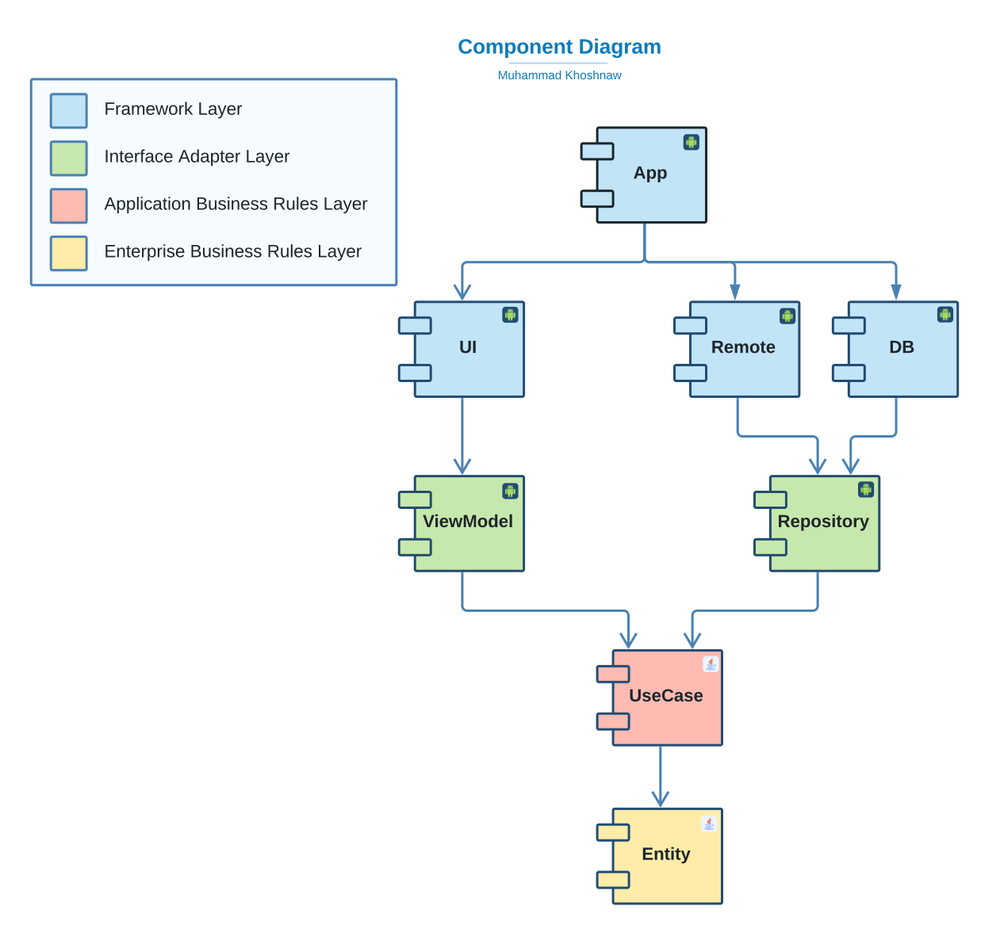
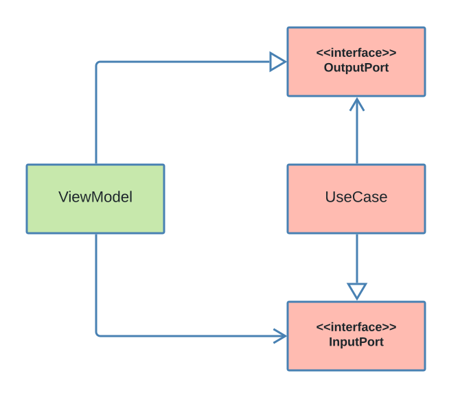

# BasicMVIApp

This application is a basic study application that implements clean architecture, with MVI architecture pattern. In addition to the most commonly used
tools in the android development community.

# Motivation

When starting a new project it is always difficult to build the setup environment. Building the application architecture and choosing the desired
architecture pattern (MVI, MVVM or MVP) can be challenging. I always Liked to have a template that I can use whenever I need it. In addition, when
using this template in a large application you discover the pros and cons of your template structure. And you can always come back to the template and
improve it for the next project. This Repository Will be my first android application template. In this template clean architecture and MVI
architecture pattern is my weapon of choice. m

# Application

For this template we don't need to go crazy with features. We just need enough to understand the architecture and have some basic configurations that
we can reuse In future. The application is a basic movie app. That uses [TMDB API](https://www.themoviedb.org/documentation/api) to cash a list of
popular movies. And then show it to the user. With the ability to refresh the cache when the user needed it.

# Architecture

## Introduction

Starting the development of software without a clear architecture will cause a disaster. The same way that starting construction of a building without
a clear architecture will cause a disaster. It is true that without an architecture you can go really fast for the first few features in the app but
does that really matter!
If you are not able to do any major changes in the software after a year. Logging with google took one week to implement but after one year of
development logging in with Facebook took a month or two and even then it was really buggy. If you are too scared to do anything in the software after
a few years. Does building the first few features fast really matter?

> “The only way to go fast, is to go well.”
> ― Robert C. Martin, Clean Architecture

## Clean Architecture

There are multiple common architectures that you can use for your software. But I think clean architecture is the most commonly used architecture in
the android development community. So I choose to use clean architecture for this template. While studying Clean architecture I read multiple articles
about implementing clean architecture in android. I also checked a few GitHub repositories but most of them didn't have what I wanted. I believe most
of them are the wrong implementation of clean architecture and the implementation violated the architecture principles. So for this template, I will
depend on this article by [Robert C. Martin](https://blog.cleancoder.com/uncle-bob/2012/08/13/the-clean-architecture.html)


As shown in the above diagram the template consists of 4 architecture layers. Be careful that those layers are architecture layers AND YOU DON’T HAVE
TO CREATE A MODULE FOR EACH LAYER. Software components (modules) are different from architecture layers. You can have as many software components as
you need in each architecture layer. In android, we create software components by modules. So for example we can separate our entities into two
different modules or even more. The same thing applies to use cases and other layers.



For this template, nine different software components have been used as shown in the diagram.

1. In the innermost layer, we have an entity which is a java module.
2. Then In the second layer, we have useCase another java module.
3. For the third layer, we have three modules: controller and gateway are java modules. But ViewModel is an android module with a minimum dependency
   on the android platform as possible.
4. And in the outermost layer, We have 4 heavily dependent on the android framework modules. The application is our actual application module. UI,
   Remote and DB which are also android modules.

Of Course, you can have more layers but I don’t think having fewer layers will be a good idea. For this template, we are trying to have the most basic
implementation possible so we go with 4 layers.

# Entity

In our entity, we have our [Movie](entity/src/main/java/com/khoshnaw/entity/Movie.kt) Class which have some movie properties.

```
data class Movie(
    val id: String,
    val posterPath: String,
    val title: String,
    val voteAverage: Double,
)
```

## TestFixtures

In this module, we also have some test fixtures. [MovieDummies](entity/src/testFixtures/java/com/khoshnaw/entity/MovieDummies.kt) have some dummy
movie objects that we will need in our tests.

```
@Suppress("unused", "MemberVisibilityCanBePrivate")
object MovieDummies {

    val dummyMovie = Movie(
        id = "0",
        posterPath = "/b6qUu00iIIkXX13szFy7d0CyNcg.jpg",
        title = "Eternals",
        voteAverage = 7.3
    )

    val dummyMovie1 = Movie(
        id = "1",
        posterPath = "/aWeKITRFbbwY8txG5uCj4rMCfSP.jpg",
        title = "Sing 2",
        voteAverage = 8.3
    )

    val dummyMovie2 = Movie(
        id = "2",
        posterPath = "/1g0dhYtq4irTY1GPXvft6k4YLjm.jpg",
        title = "Spider-Man: No Way Home",
        voteAverage = 8.4
    )

    val dummyMovie3 = Movie(
        id = "3",
        posterPath = "/sg4xJaufDiQl7caFEskBtQXfD4x.jpg",
        title = "Ghostbusters: Afterlife",
        voteAverage = 7.6
    )

    val dummyMovie4 = Movie(
        id = "4",
        posterPath = "/4j0PNHkMr5ax3IA8tjtxcmPU3QT.jpg",
        title = "Encanto",
        voteAverage = 7.8
    )

    val dummyMovie5 = Movie(
        id = "5",
        posterPath = "/7uRbWOXxpWDMtnsd2PF3clu65jc.jpg",
        title = "Resident Evil: Welcome to Raccoon City",
        voteAverage = 6.1
    )

    val dummyMovieList = listOf(
        dummyMovie,
        dummyMovie1,
        dummyMovie2,
        dummyMovie3,
        dummyMovie4,
        dummyMovie5,
    )
}
```

ExceptionDummies have a FakeException object that we will use in our tests.

```
object ExceptionDummies {
    val dummyException = FakeException()
}

```

```
class FakeException : Exception()
```

# UseCase

In most clean architecture implementations you see that useCasees are just a class with a single method. I don’t know where that concept comes from.
But I don’t think that this concept is related to clean architecture. UseCase is much more than a class with a single method. It is your user story.
your business rules. You basically need to translate the user story that you have in your Jira ticket to a UseCase class in your Application Business
Rules layer.

## Base Implementation

Back to our template in the base package, you will see InputPort, OutputPort And UseCase base classes.



As you can see the controller has an object of the UseCase that has an InputPort type. And then the UseCase has an Object of ViewModel with the type
OutputPort. This will reverse the dependency between UseCase and ViewModel. Let’s look at the actual code.

```
interface InputPort<in O : OutputPort> {
suspend fun registerOutputPort(outputPort: O)
}
```

Our InputPort has a general type of OutputPort. We will be using this general type in the registerOutputPort function to register the ViewModel in the
UseCase as an outputPort. You might think that this is better to be done with dependency injection. Well, you are absolutely right, But I faced some
limitations with android ViewModels that made me not able to use dependency injection to bind the ViewModel to the outPort. So I’m sticking to this
function for now. Maybe in the future, I will find a better solution for this.

The OutputPort is a simple interface.

```
interface OutputPort
```

Now coming to the main course, UseCase has a general type of OutputPort that we use for the outputPort variable. The onReady function will be called
right after the outputPort is registered. So you can run your setup code. We also have the default implementation for registerOuputPort.

```
abstract class UseCase<O : OutputPort> : InputPort<O> {
    protected lateinit var outputPort: O

    protected open suspend fun onReady() = Unit

    override suspend fun registerOutputPort(outputPort: O) {
        this.outputPort = outputPort
        onReady()
    }
}
```

Then last but not least we have the base Gateway interface. Which is an empty interface that might be useful in future for some polymorphism
implementation. We will discuss Gateways in more detail later on. But for now, you just need to know that Usecases will use a gateway to access data
in our android framework. Like data in remote API or local DB.

```
interface Gateway
```

# Gateways

For this template, we only have one gateway called [MovieGateway](useCase/src/main/java/com/khoshnaw/usecase/movie/gateway/MovieGateway.kt)

```
interface MovieGateway : Gateway {
    suspend fun updateMovieList()
    suspend fun observeMovies(): Flow<List<Movie>>
    suspend fun loadMovieSize(): Int
}
```

## LoadMovieList

Let's look at [LoadMovieListInputPort](useCase/src/main/java/com/khoshnaw/usecase/movie/loadMovieList/LoadMovieListInputPort.kt). Your input port has
one command that starts updating a movie list in the system cash.

```
interface LoadMovieListInputPort : InputPort<LoadMovieListOutputPort> {
    suspend fun startUpdatingMovieList()
}
```

Then we have [LoadMovieListOutputPort](useCase/src/main/java/com/khoshnaw/usecase/movie/loadMovieList/LoadMovieListOutputPort.kt) which has two
commands showLoading that hide and show loading while the movie is loading. And observeMovies provides a flow that can be used to observe the list of
movies in our cash.

```
interface LoadMovieListOutputPort : OutputPort {
    suspend fun showLoading(loading: Boolean)
    suspend fun observeMovies(flow: Flow<List<Movie>>)
}
```

Now let's check the [LoadMovieList](useCase/src/main/java/com/khoshnaw/usecase/movie/loadMovieList/LoadMovieList.kt). Our usecase has a movieGateway
object that will be used to access systems data. In onReady we are making our output port observe the locally cached movie list using our movieGateway
object. When the usecase is ready we also load new movies if we don’t have any movies in our cash.

The startUpdatingMovieList is used to start the loading of a new movie process. First, we tell our output port to show the loading. Then we try to
update our movies locally using our gateway, then we hide the loading again. Notice that if we fail to update movies we throw an exception. But we are
throwing the exception after we hide the loading.

```
class LoadMovieList @Inject constructor(
    private val movieGateway: MovieGateway,
) : UseCase<LoadMovieListOutputPort>(), LoadMovieListInputPort {

    override suspend fun onReady() {
        observeMovies()
        loadMoviesIfNeeded()
    }

    override suspend fun startUpdatingMovieList() {
        showLoading()
        val e = tryTo { updateMovies() }
        hideLoading()
        e?.let { throw e }
    }

    private suspend fun loadMoviesIfNeeded() {
        if (movieGateway.loadMovieSize() <= 0) startUpdatingMovieList()
    }

    private suspend fun observeMovies() = outputPort.observeMovies(movieGateway.observeMovies())

    private suspend fun showLoading() = outputPort.showLoading(true)

    private suspend fun hideLoading() = outputPort.showLoading(false)

    private suspend fun updateMovies() = movieGateway.updateMovieList()

}
```

## Utils

For utils, we have [tryTo](useCase/src/main/java/com/khoshnaw/usecase/utils/util.kt) function that tries to do some action then return the exception
if the action failed it returns the exception.

```
suspend inline fun tryTo(crossinline action: suspend () -> Unit): Exception? = try {
    action()
    null
} catch (e: Exception) {
    e
}
```

# Gateway

The gateway module is a pure java module. This module contains our gateway implementation with it is data sources.


As shown in the UML diagram, our usecase has a weak reference to the gatewayImp class which is the gateway implementation in the third layer of our
architecture. Then our gateway implementation has multiple local or remote data sources. Those interfaces are in the third layer as well. But the
implementation of those data sources is in the fourth layer. The Implementation of the remote data sources is in the remote module. And we call them
API data sources. Those data sources are using public movie DB APIs. And then the implementation of the local data source is in the DB module and we
call them DBDataSource. DB data sources are using room databases to do their tasks.

## Base Implementation

Our base implementation is just an empty class called [GatewayImp](gateway/src/main/java/com/khoshnaw/gateway/base/GatewayImp.kt) that implements the
Base Gateway interface. Again this can be useful in future for polymorphism reasons.

```
abstract class GatewayImp : Gateway
```

## gatewayImps

Our only GatewayImp is MovieGatewayImp this is gateway is responsible to provide movie data that the system needs. The gateway has one remote data
source and one local data source. It is also implementing our MovieGateway interface in the second layer.

Then the updateMovieList function is using a remote data source to load new remote movies and then uses the local data source to update the locally
cashed movie list.

The function observeMovies is returning a flow of movies that can be used to observe the locally cashed movies.

And loadMovieSize is just returning the size of locally cached movies.

```
class MovieGatewayImp @Inject constructor(
    private val movieRemoteDataSource: MovieRemoteDataSource,
    private val movieLocalDataSource: MovieLocalDataSource,
) : GatewayImp(), MovieGateway {

    override suspend fun updateMovieList() =
        movieLocalDataSource.updateMovieList(movieRemoteDataSource.loadMovieList())

    override suspend fun observeMovies() = movieLocalDataSource.observeMovies()

    override suspend fun loadMovieSize(): Int = movieLocalDataSource.loadMovieSize()

}
```

## LocalDataSources

Our local data source [MovieLocalDataSource](gateway/src/main/java/com/khoshnaw/gateway/localDataSource/MovieLocalDataSource.kt) has three functions
to update the movie list another to observe the movies and the last one to load movies size.

```
interface MovieLocalDataSource {
    suspend fun updateMovieList(movieList: List<Movie>)
    suspend fun observeMovies(): Flow<List<Movie>>
    suspend fun loadMovieSize(): Int
}
```

## RemoteDataSource

The remote data source [MovieRemoteDataSource](gateway/src/main/java/com/khoshnaw/gateway/remoteDataSource/MovieRemoteDataSource.kt) has one function
to load a list of remote movies.

```
interface MovieRemoteDataSource {
    suspend fun loadMovieList(): List<Movie>
}
```

# Controller

Controllers are intermediates between our view model and use cases. A controller can have multiple use cases of the type input port.

## Base Implementation

Our base implementation named (Controller)[controller/src/main/java/com/khoshnaw/controller/base/Controller.kt] has a generic type InputPort, Also
another generic type OutputPort. We need an object of the inputPort in order to be able to register the output port to the input. And then the
registerOutputPort do the registration of the output port.

```
abstract class Controller<out I : InputPort<O>, in O : OutputPort> {
    abstract val inputPort: I

    suspend fun registerOutputPort(outputPort: O) = inputPort.registerOutputPort(outputPort)
}
```

## Controllers

Our [MovieController](controller/src/main/java/com/khoshnaw/controller/movie/MovieController.kt) have two functions one to start loading movies. And
another to show a specific movie. That is just printing a log.

```
class MovieController @Inject constructor(
    override val inputPort: LoadMovieListInputPort,
) : Controller<LoadMovieListInputPort, LoadMovieListOutputPort>() {

    suspend fun loadMoviesList() = inputPort.startUpdatingMovieList()

    suspend fun showMovie(movie: Movie) = println("showing movie : $movie")
}
```

# MVI

Before discussing ViewModel we need to discuss a litlebit about MVI architecture pattern.

# ViewModel

# UI

# Remote

The Remote module is an Android module that is heavenly depending on the android framework to do any remote operation. This module is using tools like
OkHttp, Retrofit and Moshi. To perform a network HTTP requests to the Movie DB API then parse and map the result to an entity represented object.

## APIDataSource

The API data source is the actual implementation of the remote data sources. Those classes are using movie DB API to access the remote data in the
system.

The base implementation is an empty Class called [APIDataSource](remote/src/main/java/com/khoshnaw/remote/apiDataSource/base/APIDataSource.kt)

```
abstract class APIDataSource
```

The (MovieAPIDataSource)[remote/src/main/java/com/khoshnaw/remote/apiDataSource/movie/MovieAPIDataSource.kt] is using movieApi that is provided by
retrofit to perform movie-related remote operating. Like loading movie list using LoadMovieList function. Notice that the movieApi class is returning
a MovieRemoteDTO movie object but we use a mapper to map the DTO to an entity.

```
class MovieAPIDataSource @Inject constructor(
    private val movieApi: MovieApi
) : APIDataSource(), MovieRemoteDataSource {
    override suspend fun loadMovieList(): List<Movie> =
        movieApi.loadMovieList().bodyOrException().movieList.toEntity()
}
```

## RemoteDTO

The package DTO has our remoteDTO s like [MovieRemoteDTO](remote/src/main/java/com/khoshnaw/remote/dto/MovieRemoteDTO.kt) those DTO are data transfer
objects that can be used to pars API JSON or encode data to JSON.

```
data class MovieRemoteDTO(
    val id: String,
    @Json(name = "poster_path") val posterPath: String,
    @Json(name = "original_title") val title: String,
    @Json(name = "vote_average") val voteAverage: Double,
)
```

## Mapper

Our mappers are responsible to map entities to RemoteDTO or vice versa. For example, check
out [MovieMapper.kt](remote/src/main/java/com/khoshnaw/remote/mapper/MovieMappers.kt) file

```
fun MovieRemoteDTO.toEntity() = Movie(
    id = id,
    posterPath = posterPath,
    title = title,
    voteAverage = voteAverage,
)

fun List<MovieRemoteDTO>.toEntity() = map { it.toEntity() }
```

# DB

# APP

# What to improve

## Injecting Output Port

## Controller

```
Copyright (c) <2021> <Muhammad Khoshnaw>

Permission is hereby granted, free of charge, to any person obtaining a copy of this software and associated documentation files (the "Software"), to
deal in the Software without restriction, including without limitation the rights to use, copy, modify, merge, publish, distribute, sublicense, and/or
sell copies of the Software, and to permit persons to whom the Software is furnished to do so, subject to the following conditions:

The above copyright notice and this permission notice shall be included in all copies or substantial portions of the Software.

THE SOFTWARE IS PROVIDED "AS IS", WITHOUT WARRANTY OF ANY KIND, EXPRESS OR IMPLIED, INCLUDING BUT NOT LIMITED TO THE WARRANTIES OF MERCHANTABILITY,
FITNESS FOR A PARTICULAR PURPOSE AND NONINFRINGEMENT. IN NO EVENT SHALL THE AUTHORS OR COPYRIGHT HOLDERS BE LIABLE FOR ANY CLAIM, DAMAGES OR OTHER
LIABILITY, WHETHER IN AN ACTION OF CONTRACT, TORT OR OTHERWISE, ARISING FROM, OUT OF OR IN CONNECTION WITH THE SOFTWARE OR THE USE OR OTHER DEALINGS
IN THE SOFTWARE.
```
